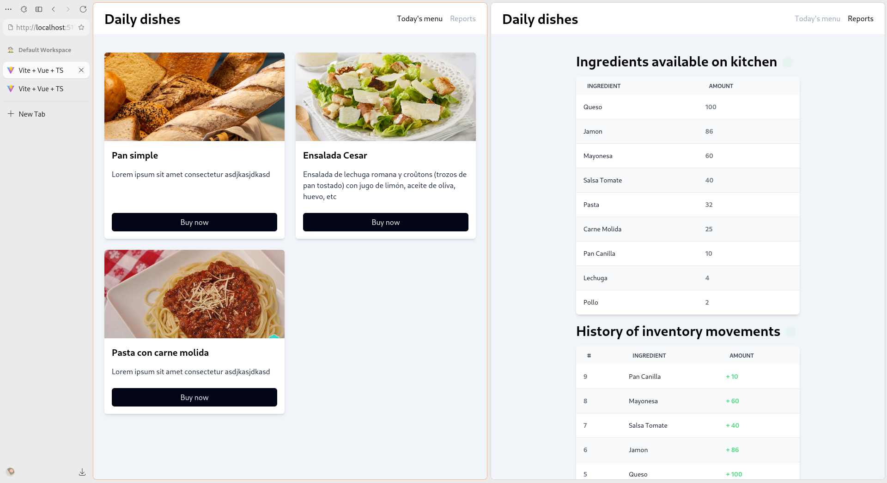

# Kitchen app (microservices example)

This is an example application i made in order to learn about microservices and backend infrastructure.

> [!NOTE]
> This application aims to serve as a demonstration repository about all the concepts am about to break down below, so you can use this as a repository to see some examples about the usage of some the technologies i used here, but keep in mind that here a lot of things can also be improved, like project structure, etc.

## Technologies

This app uses several technologies in order to work:

- **vuejs**: frontend application
- **kafka**: communicate between services by sending messages and keeping them in storage for next run
- **websockets**: in order to subscribe certain parts of the frontend to backend state
- **express**: create simple http servers with routes
- **bun**: man, this bun makes so easy to configure a new typescript project and gives you cool apis (love the sqlite one)
- **sqlite**: databases lmao
- **maybe im missing something**: ;-;

## What's this about?

The idea was to make some application which would teach myself how could i be communicating across backend
microservices and keep data synchronized across all the services i share, so i can have two applications consuming
different topics on the kafka event pool, but they should have synchronized data (this was harder than it seemed at the start though)

Ok well i could tryna make some kind of diagram and i tried but it sucks so yeah here's the explanation about what this thing does lmao

### Database structure

- `kitchen-service`: Represents the kitchen where all the dishes are gonna be stored, with their respective ingredients... Also note that we'll have to keep an internal inventory about the ingredients we have on kitchen (not associated with the inventory on the warehouse)
- `warehouse-service`: We'll here contain a warehouse with preloaded materials, so others services can ask us about materials they need, and we'll have to **always** supply them with those, if we can't afford the request, we'll have to go buy em with the `market-service`, which will provide a random number (simulation) of the product we've asked it for... so we'll have to keep asking to the market if it doesn't gives us the required number :) (this is made this way in order to increase the difficulty a little bit)
- `market-service`: As explained previously, this service doesn't even has any database, but instead serves the requested material randomly, so the service asking for it will have to hang until we satisfy its needs (this can be done in multiple requests tho, anyways this is an experiment project so doesn't matters)

### Core Application flow

1. When you open the app it will give you some dishes to buy from the kitchen database (some examples of them can be found
on the seeder of the `kitchen-service` application [seeds](../kitchen-service/database/seeds.sql))
2. If you ask for a dish (provided by the `kitchen-service`), we'll have to ask the kitchen service to buy a new `x` dish (prepared food in the schema because, uh, idk why i did call it prepared-food in the schema, i cant change it anymore so yeah), when we ask for that dish, the kitchen service will lookup for any missing materials in its internal inventory, if there's any missing inventory, we'll go to step 3, if not, we can just discount the materials from our inventory and return the bought dish.
3. If there's any missing material, we'll have to ask the `warehouse-service` for those missing materials, this is where kafka comes in, because its messaging system is insanely fast, and efficient af... so well, we send different messages for each material to the warehouse topic, asking for the required amount of those elements (in different messages)
4. The `warehouse-service` catches those events, and has to process them, how? well, it will tryna check for those materials on its internal storage (its own database diff to the kitchen one), and if it can afford the request, it will just return that material and discount the required amount from its database, if it can't afford the request, we'll have to go to step 5 ;-;
5. If we can't afford the required request of x material, we'll have to buy it with the `market-service` which will return a random number, so we'll have to keep waiting till it gets *at least* the required amount asked by the event we've caught... once we have the required amount, we'll have to add it to our inventory (warehouse) and then discount the required amount so we can return them in **other event**, yeah, we generate another event with another topic: `kitchen`.

> [!NOTE]
> This is where fun begins tbh, because, i wanted to add some more complexity here, and it's that we won't return response on **step 2** until we process again those events with topic `kitchen` :) so we'll have to block the request until we get those *expected events* from the warehouse service :) and as you can think, this is not that easy to implement... There're several ways though, we could maybe subscribe to the database of the warehouse from within the `kitchen-service` but the approach i took here was quite interesting instead :>

6. Back in the kitchen-service, we'll have to block the request when we sent those `warehouse` topic events, so we can wait for the resultant `kitchen`, and how will we wait for this? well, that's where [signalis](../kitchen-service/src/signalis.ts) comes in, but, what's signalis? well, it's a simple utility I made which helps us communicate from others parts of our code and wait for internal events, like, we've some part which blocks until we get an event, and another part of the code that runs asynchronously, emits that event, well, we unlock the other part of the code since someone emitted the event, so in resume, signalis is a simple broadcasting system for your app, it's really light in loc (lines of code), and works real great though
7. Well in order to block, we'll just wait for some event using signalis when we sent those `warehouse` events (the event is called [`"kitchen-notif:with-product"`](https://github.com/AlphaTechnolog/microservices-example/blob/89c07c9003671ebf61b4de26fe94414d1904e35c/kitchen-service/src/routes/prepared-food.ts#L138)), and this event will be sent by the kafka consumer we setup early before starting to listen for the `/order` route, so when we receive those `kitchen` events, we can unlock the `await` statement because we sent the required event, but what if we sent multiple `warehouse` events, and we expect multiple `kitchen` events before the unlock of the signalis event? well, that's too long to explain here and i already explained it in the source code [here](https://github.com/AlphaTechnolog/microservices-example/blob/89c07c9003671ebf61b4de26fe94414d1904e35c/kitchen-service/src/routes/prepared-food.ts#L38) (see the `eventsWaitlist` "algorithm" or whatever i made there lmao)... The `requestId` thing is to prevent our process to consume events from another request :)
8. When we get the required materials from the events, we can then proceed to add them to our inventory and then substract them because so requires the required dish by the user ingredients.
9. After doing all this process, we can successfully respond the user with the dish they asked for, and all the inventories should be synced (well when i mean synced, i mean, they're working fine, because they'll always be different, but kitchen-service's inventory should **never** according to the process have one item with `amount <= -1`)

> [!TIP]
> Notice all the mess i did with the eventWaitlist and signalis just to wait for the request, they may be easier approaches though, but that was my solution i wanted to deal with tho, for the fun! :) also, keep in mind we don't even need to respond with those materials, so we could just discount them from the inventory directly from the consumer and then do all that process even **after** we responded from the backend because the consumer would process them after the warehouse-service responds via messaging.

### Extras

1. When you go to the reports page, you can see an inventory in a table, this table will show all the actual ingredients in the `kitchen-service` inventory, not the warehouse one, but not only that but also a list of the movements on database of all the inventory (this because the `ingredients` table just holds a bunch of operations like `x product -1`, `x product +12`, `b product -5`, ..., so we can then sum and group them with sql and obtain the resultant at the end but also keep a history of the movements)
2. Interesting thing about this part is that those tables live reload their data, how do they do this? via a websocket that connects to a service called `kitchen-history-modifier`, this service will keep listening to some messages from kafka which notifies about history movements on the `kitchen-service` and expose a websocket which gets those kafka messages redirect into it so the frontend can subscribe to those kafka messages... keep in mind that exposing the kafka connection in the frontend should never be done lmao
3. These events with topic `kitchen-inventory-notifications` are produced by the database service of the `kitchen-service` when one attempts to modify the `ingredients` table so yeah, it will keep always up to date.
4. The ingredients table is quite special though because instead of adding those messages (which comes with the structure like: `{"name": "product x", "amount": -5}`), it will have to look for that product on its table and then substract or add the `"amount"` it needs to, this will allow us to update that table without ever needing to ask again to the database and forcing it more, which is better for the database and the app in general

## Conclusion

This project really served me to learn about all these things and was interesting to build, so i hope this serves someone to learn about these technologies about their usage by using this repository as example code, that would be great... if you think so aswell, consider leaving a star which would help the repository appear to more people aswell

## TODO

- [ ] Improve code quality by using `.env`
- [ ] Deploy application somewhere (?)
- [ ] Improve project structure
- [ ] Better error handling on frontend
- [ ] Implement timestamps on database schema